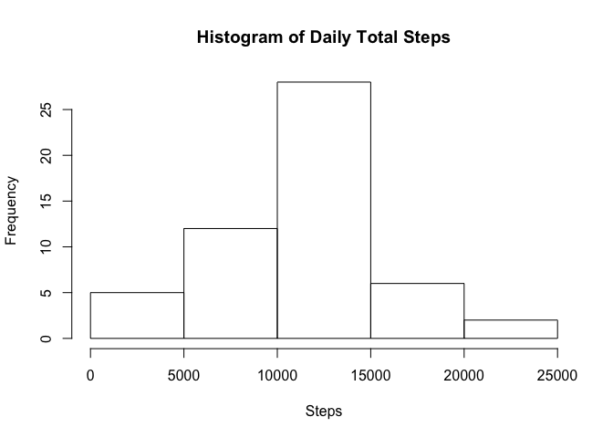
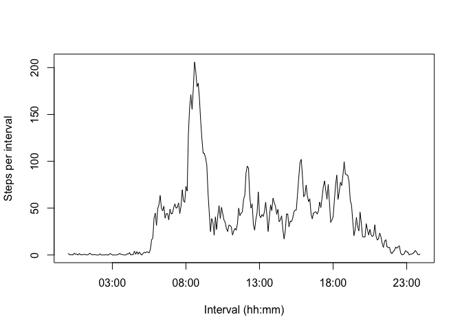
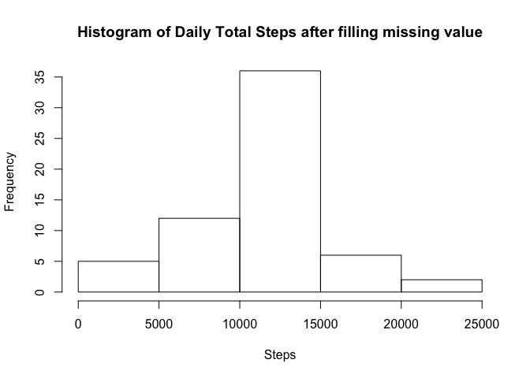
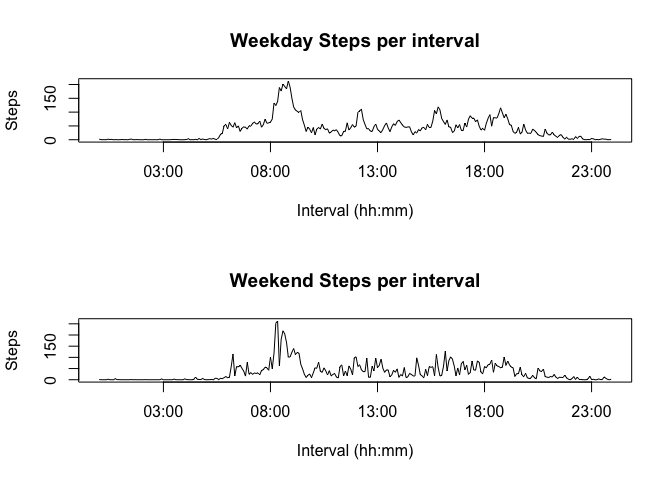

# Reproducible Research: Peer Assessment 1


## Loading and preprocessing the data

```r
data <- read.csv("activity.csv")
```


## What is mean total number of steps taken per day?

```r
options(scipen = 3, digits = 3)
dailystep <- aggregate(steps ~ date, data = data, FUN = sum)
meanstep <- mean(dailystep$steps, na.rm = TRUE)
medianstep <- median(dailystep$steps, na.rm = TRUE)
```

    *The mean of the total number of steps taken per day is 10766.189.    
    *The median of the total number of steps taken per day is 10765.    
    *The histogram of the daily total steps is as below:


```r
hist(dailystep$steps, xlab = "Steps", main = "Histogram of Daily Total Steps")
```



## What is the average daily activity pattern?

1. The time series plot of average daily activity is as below:


```r
intervals <- aggregate(steps ~ interval, data = data, FUN = mean)
intervals$intervalnew <- strptime(sprintf("%04d", as.numeric(intervals$interval)), format="%H%M")
plot(intervals$intervalnew, intervals$steps, type="l", xlab="Interval (hh:mm)", ylab="Steps per interval")
```



```r
options(scipen = 3, digits = 0)
maxstep <- max(intervals$steps)
maxinterval <- subset(intervals, steps == max(steps))$intervalnew
```

2. 5-minute interval of 08:35, on average across all the days in the dataset, contains the maximum number of steps of 206. 


## Imputing missing values


1. Calculate and report the total number of missing values in the dataset (i.e. the total number of rows with NAs)


```r
NAcount <- sum(is.na(data$steps))
```

    There is totally 2304 'NA' values in the dataset.


2. Devise a strategy for filling in all of the missing values in the dataset. The strategy does not need to be sophisticated. For example, you could use the mean/median for that day, or the mean for that 5-minute interval, etc.


    In this report, the mean value for that 5-minute interval is used.
    
3. Create a new dataset that is equal to the original dataset but with the missing data filled in.


```r
datanew <- merge(data, intervals, by.x = "interval", by.y = "interval")
colnames(datanew) <- c("interval", "steps", "date","avgsteps", "intervalnew")
datanew$steps <- ifelse(is.na(datanew$steps), datanew$avgsteps, datanew$steps)
```

    The code above generates a new data frame "datanew" with the missing data filled in.


4. Make a histogram of the total number of steps taken each day and Calculate and report the mean and median total number of steps taken per day. Do these values differ from the estimates from the first part of the assignment? What is the impact of imputing missing data on the estimates of the total daily number of steps?


```r
options(scipen = 3, digits = 3)
dailystepnew <- aggregate(steps ~ date, data = datanew, FUN = sum)
meanstepnew <- mean(dailystepnew$steps, na.rm = TRUE)
medianstepnew <- median(dailystepnew$steps, na.rm = TRUE)
```
    After filling the missing value:    
    *The mean of the total number of steps taken per day is 10766.189    
    *The median of the total number of steps taken per day is 10766.189    
    *The new histogram of the daily total steps is as below:


```r
hist(dailystepnew$steps, xlab = "Steps", main = "Histogram of Daily Total Steps after filling missing value")
```



    Remember without filling the missing data, the mean is 10766.189 and the meadian is 10765, those two values are not the same. However, after we refill the data, the mean and median values are closer. From the histogram, we can see the distribution gets centered.


## Are there differences in activity patterns between weekdays and weekends?


```r
datanew$dayofweek <- weekdays(as.Date(dailystepnew$date), abbreviate = TRUE) 
datanewweekday <- subset(datanew, dayofweek %in% c("Mon","Tue","Wed","Thu","Fri") ) 
datanewweekend <- subset(datanew, dayofweek %in% c("Sun","Sat") ) 


intervalsweekday <- aggregate(steps ~ interval, data = datanewweekday, FUN = mean)
intervalsweekday$intervalnew <- strptime(sprintf("%04d", as.numeric(intervalsweekday$interval)), format="%H%M")
intervalsweekend <- aggregate(steps ~ interval, data = datanewweekend, FUN = mean)
intervalsweekend$intervalnew <- strptime(sprintf("%04d", as.numeric(intervalsweekend$interval)), format="%H%M")

par(mfrow=c(2,1))
plot(intervalsweekday$intervalnew, intervalsweekday$steps, type="l", xlab="Interval (hh:mm)", ylab="Steps", main = "Weekday Steps per interval")
plot(intervalsweekend$intervalnew, intervalsweekend$steps, type="l", xlab="Interval (hh:mm)", ylab="Steps", main = "Weekend Steps per interval")
```


